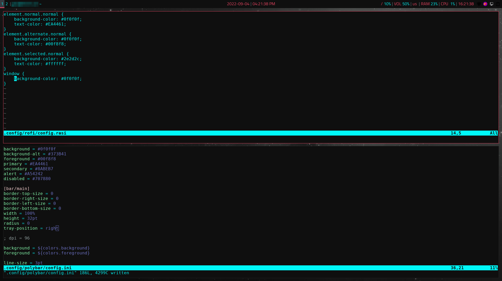
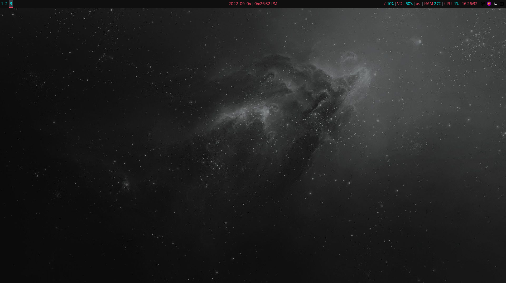

# cyberspace-theme
A sci-fi and cyberpunk inspired colorscheme

## Installation
* Move ``rofi/config.rasi`` to ``~/.config/rofi/config.rasi``
* Move ``polybar/config.ini`` to ``~/.config/polybar/config.ini``
* For the font to show up properly on the polybar and in rofi, you will need to:
  - Download the [Titillium Web](https://fonts.google.com/specimen/Titillium+Web?query=Titillium+Web) font family zip
  - Extract the zip and move ``TitilliumWeb-Regular.ttf`` to ``~/.local/share/fonts``

## Screenshots

